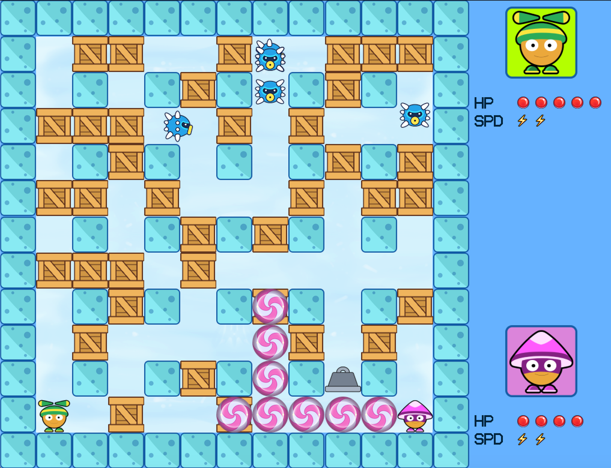

<h1 align="center">SugarBomb</h1>

<h2>Introduction</h2>

This game contains two players. The player can use the keyboard buttons to move its role and place bombs. The goal is to hurt each another as much as possible. The survivor who lasts to the end will be the winner.

<p align="center">
   
</p>

<h2>User Guide</h2>

<h3>Role</h3>

Player 1 controls the green drawf in the picture and Player 2 controls the purple one. The control keys are shown as below:

| |  |  |
:----:|:----:|:----:
| MOVE UP | `W` | `UP` |
| MOVE DOWN | `S` | `DOWN` |
| MOVE LEFT | `A` | `LEFT` |
| MOVE RIGHT | `D` | `RIGHT` |
| PLACE BOMB | `TAB` | `ENTER` |

A role is initialized with 5 HP points and speed level 2. A role dies when it loses all the HP points. Each role can place at most 5 unexploded bombs at the same time.

<h3>Monster</h3>

<p align="center">
   
</p>

A little silly neutral participant of the game. It moves randomly at will and cause a player to lose one HP point on encounter.

<h3>Bomb</h3>

On placing bomb, a bomb (represented by a sugar swirl) will appear on the grid where the player is standing.

It usually takes 4 seconds before a bomb explodes. However, a bomb can detonate other nearby bombs under its blast wave (represented by rotating sugar swirls), making the waiting time smaller than 4 seconds. The blast wave can also introduces one HP point lose to a role, kill a monster and destroy a box/prop. The wave will be blocked when it reaches an obstacle (either a box or a block).

<p align="center">
   
</p>

<h3>Prop</h3>

Find what exists in the box when it is destroyed! It is a prop that can be picked up by the player.

Name | Icon | Function |
:----:|:----:|:----
| Powder |  | The length of explosion blast wave will be increased by one grid on each direction. |
| Honey |  | The moving speed of the player will be increased by one unit (max = 5 units). |
| Weight |  | The moving speed of the player will be decreased by one unit (min = 1 unit). |
| Banana Peel |  | Caution! Player will lose its control and moving in a high speed until it hit any obstacle. |

<h2>Compile Instruction</h2>

1. Change to the directory `<PROJECT_DIR>/src/`.

2. Build with the following command.

For MacOS:

```bash
make -f makefile.mac
```
For Linux:

```bash
make -f makefile.glx
```

3. Find the executable file in the directory `<PROJECT_DIR>/build/`.

For MacOS, the filename is `SugarBomb.app`

For Linux, the filename is `SugarBomb`

